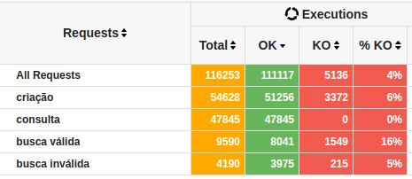
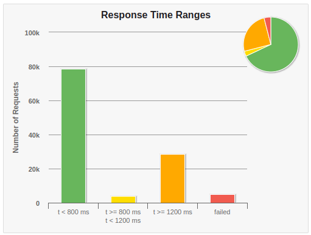

# rinha-de-backend-node

This project was my participation in [Rinha de Backend](https://github.com/zanfranceschi/rinha-de-backend-2023-q3). The central idea was to build the most performatic API while adhering to some rules and run a stress test to determine which one performs better.

The API has 3 endpoints:

-   **POST**: /pessoas
    -   Performs body validations and creates the user in the database.
-   **GET**: /pessoas/id
    -   Searches for the person with that ID in the database.
-   **GET**: /pessoas?t=jo
    -   Searches for all users whose names, nicknames, or stacks contain "jo".

I made an implementation which uses Redis as a cache database.

### Inserts
The principal metric of the challenge was the user inserts into the database. Pub/sub implementation performed better in this aspect.

Average inserts:
- **45800** people

| Success rate | Time ranges |
|--|--|
|  |  |
